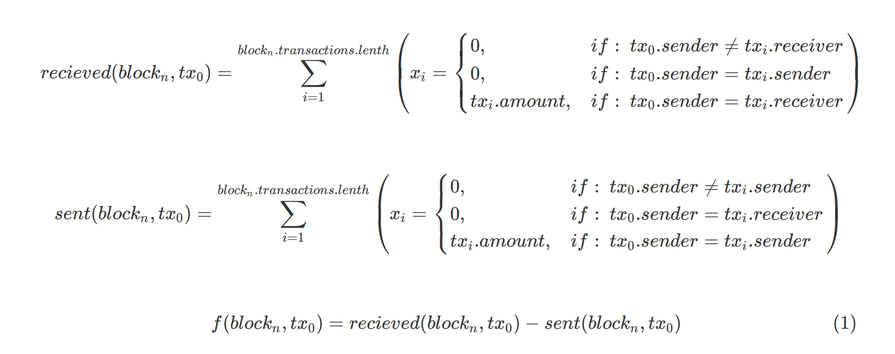
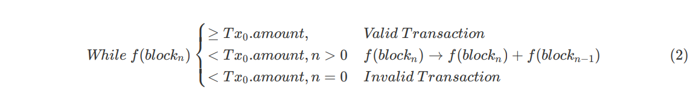

<h1 align="center">Faradicoin</h1>

<!-- 
Faradical auto_sear#8264 www.github.com/faradical
 -->

## Abstract
Faradicoin is a project developed to explore and demonstrate the underlying technology of crypotocurrencies. It is constructed on a Proof-of-Work based Blockchain similiar to what is used Bitcoin and other cryptocurrencies. The project is currently written in JavaScript using the MERN stack with the elliptic module handling encryption keys and crypto-js/sha256 to perform cryptographic hashing. It demonstrates all the basics of a modern cryptocurrency including the technical aspects and core principles required in creating a viable currency using a decentralized, trustless network. All hashes are in hexidecimal format.

<!---
## Objective
--->

## Documentation
* [Read or download the white paper](https://github.com/faradical/faradicoin/blob/master/README.pdf)
* [Setting up a wallet]()
* [Setting up a miner]()
* [Purchasing Faradicoin]()

## Transaction Verification
Transactions in Faradicoin are constructed at the wallet level and submitted to miners in JSON format. Each transaction features five default properties: 
* **Sender address:** Or the Wallet address, the public key of the sender.
* **Reciever address:** The public key of the reciever.
* **Transaction amount:** The amount of Faradicoin to be sent.
* **Time stamp:** Time when the transaction is created by the wallet.
* **Previous Hash:** The hash of the last transaction created by the sender wallet, with the initial-use hash being 0.

A new SHA256 hash for the transaction is then created using the Sender, Reciever, Amount, and Previous Hash properties. At this point, the **key pair object* is used to sign the hash. This ensures no two messages will have the same hash/signature pair, eliminating the possibility of transaction forgery. 

<!-- Need to edit this image to show the .get_hash() method being used by .sign_tx() and not the hash property. -->

Transactions are then POSTed to the `/transaction` route of all miners in the wallet's network, allowing them to compete with each other to process the transaction quicker than the other nodes and thus increase their likelihood of claiming the reward. As transactions are received by the miners, they immediately begin validating signatures. First the signature property is checked to ensure it is not empty, then the Sender address is used to generate a public key object with elliptic.js and the hash (a freshly generated hash of the transaction, not the hash property) is checked against the signature using the `.verify()` method. If the transaction is valid, it is then added to the pending transaction queue.

When sufficient transactions have been sumbitted to begin mining a block, the miner will begin by verifying all of the transaction amounts are valid. This entails first checking the transactions in the pending queue, then further back on the blockchain to ensure that the sender has the appropriate amount of Faradicoin to actually complete the transaction. As checking the entire blockchain and summing the history of sent and recieved Faradicoins for each transaction would be time consuming, the miner instead works backwards, summing together all the amounts received by the address and subtracting any amounts it sent. The operation is then performed recursively, checking the transactions from the most recent validated block and continuing to add all these totals together until either the amount of faradicoin available exceeds the amount to be transacted, or the current blockchain is exhausted.

 

<!--  
 
 
$$
\text{}
\\
recieved(block_n,tx_0)=\sum_{i=1}^{block_n.transactions.lenth}\left(x_i =
    \begin{cases}
        0, & if:\text{ }tx_0.sender\ne tx_i.receiver\\
        0, & if:\text{ }tx_0.sender= tx_i.sender\\
        tx_i.amount, & if:\text{ }tx_0.sender=tx_i.receiver\\
    \end{cases}\right)
\\
$$
$$
\\
sent(block_n,tx_0)=\sum_{i=1}^{block_n.transactions.lenth}\left(x_i =
    \begin{cases}
        0, & if:\text{ }tx_0.sender\ne tx_i.sender\\
        0, & if:\text{ }tx_0.sender= tx_i.receiver\\
        tx_i.amount, & if:\text{ }tx_0.sender= tx_i.sender\\
    \end{cases}\right)
\\
$$
$$
\begin{equation}
f(block_n,tx_0)=recieved(block_n,tx_0)-sent(block_n,tx_0)\
\end{equation}
$$ -->

<!-- 

Figure 1): The function defining the calculation of available funds for a particular address (tx0.sender, with tx0 being the transaction to validate) in blockn. Where the reciever address in the given transaction is the same as the sender being validated (i.e., where the sender has previously received funds), all such transactions are summed together. The sum of all transactions in blockn where the sender is the same as the sender in a given transaction (i.e., where the sender from previously sent some funds), is then subtracted from the first sum.

 -->
*Figure 1): The function defining the calculation of available funds for a particular address (tx0.sender, with tx0 being the transaction to validate) in blockn. Where the reciever address in the given transaction is the same as the sender being validated (i.e., where the sender has previously received funds), all such transactions are summed together. The sum of all transactions in blockn where the sender is the same as the sender in a given transaction (i.e., where the sender from previously sent some funds), is then subtracted from the first sum.*
 

<!-- $$
\begin{equation}
validate(tx_0, block_n, sum=0)=
\begin{cases}
if\text{ }(f(block_n,tx_0)+sum \ge tx_0.amount):\\
\hspace*{20mm} Valid\text{ }Transaction\\
if\text{ }(n=0):\\
\hspace*{20mm} Valid\text{ }Transaction\\
if\text{ }(f(block_n,tx_0)+sum < tx_0.amount):\\
\hspace*{20mm} sum = sum+f(block_n,tx_0)\\
\hspace*{20mm} validate(tx_0, block_{n-1},sum)\\
\end{cases}
\end{equation}
$$ -->

<!-- 

Figure 2): If the available funds given by f(blockn) is equal to or exceeds the amount attempting to be transacted, the transaction is deemed valid and added to the new block. If not, the function is called recursively, each time adding the previously returned amount to the output of f(blockn-1) until either the available funds exceeds the amount, or n = 0, at which point the transaction is declared invalid.

 -->
*Figure 2): If the available funds given by f(blockn) is equal to or exceeds the amount attempting to be transacted, the transaction is deemed valid and added to the new block. If not, the function is called recursively, each time adding the previously returned amount to the output of f(blockn-1) until either the available funds exceeds the amount, or n = 0, at which point the transaction is declared invalid.*
 

In this way, the amount of times the full blockchain must be examined is limited to scenarios where a transaction is invalid, and more frequent transactors are rewarded with faster transaction times.

## Proof-of-Work
It is necessary to implement a system in any distributed ledger by which

## Block Verification
<!---
A key element in all distributed blockchains is decentralized censensus. Network rules
--->

## Incentive vs. Trust
Why follow the rules? Because it is the best chance of making the most money, of course.
<!---
Ways to hack the current system include:
* Creating and submitting thousands of small transactions to a single mining node in order to receive a reward. Solution would involve overhaul of the network to to become fully decentralized, with all meesages being simultaneously multicast to every node on the network. Gun.js may be be a useful way to achieve this. Nodes would then reject any blocks containing transactions that were not in their pending queues (excepting mining rewards).
--->

## Further Developments
* Decentralized Network with Multicast addressing (possibly using pub/sub model or gun.js)
* Real-time verification of transaction amounts (To improve block mining time)
* Improved verification method for validating transaction amounts.
* Merkle Trees for disk space preservation via the discarding of spent transactions with breaking block hashes.
* Minimum/maximum block sizes.
* Dynamic updates to difficulty and mining reward size.
* Mining "fees" or tips that can be added to transactions for the miner to claim.
* Alternative proof systems
* Smart Contracts
* Storing data directly on the blockchain.
* Adaptive difficulty and block rewards.

## Conclusion

## Donate

